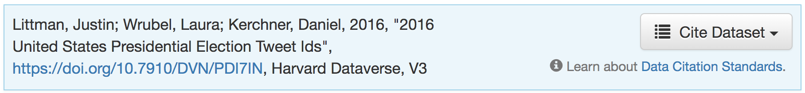
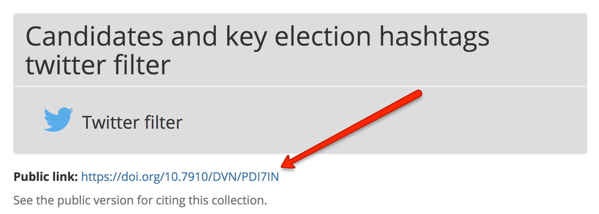

=========================
 Citing SFM and datasets
=========================

------------
 Citing SFM
------------
The recommended citation for Social Feed Manager (i.e., the software) is::

        George Washington University Libraries. (2016). Social Feed Manager. Zenodo. https://doi.org/10.5281/zenodo.597278

For more guidance on citing SFM, see `SFM in Zenodo <https://zenodo.org/record/1035227>`_.

-------------------------
 Citing a public dataset
-------------------------
Some SFM collections have been released as public datasets, usually by depositing them in a data repository. (See :doc:`releasing_datasets`).

Usually the public version will provide guidance on citing. For example, the `2016 United States Presidential Election collection <https://doi.org/10.7910/DVN/PDI7IN>`_ is deposited in `Harvard's Dataverse <https://dataverse.harvard.edu>`_, which offers the following assistance on citing:

Within SFM, a link may be provided to the public version of a dataset.

-------------------------
 Citing your own dataset
-------------------------
To make your dataset citable and reusable by others, you are encouraged to release it as public dataset. (See :doc:`releasing_datasets`). You are also encouraged to cite SFM within your dataset release and your publication.
