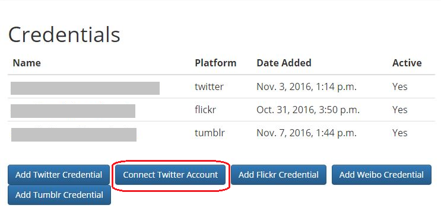

=================
 API Credentials
=================

Accessing the APIs of social media platforms requires credentials for
authentication (also knows as API keys). Social Feed Manager supports managing
those credentials.

Credentials/authentication allow a user to collect data through a platform’s
API. For some social media platforms (e.g., Twitter and Tumblr), Limits are
placed on methods and rate of collection on a per credential basis.

SFM users are responsible for creating their own new credentials so that
they can control their own collection rates and can ensure that they are
following each platform’s API policies.

Most API credentials have two parts: an application credential and a user
credential.(Flickr is the exception -- only an application credential
is necessary.)

For more information about platform-specific policies, consult the documentation
for each social media platform's API.

----------------------
 Managing credentials
----------------------

SFM supports two approaches to managing credentials: adding credentials and
connecting credentials. Both of these options are available from the
Credentials page.

Adding credentials
^^^^^^^^^^^^^^^^^^
For this approach, a user gets the application and/or user credential from the
social media platform and provide them to SFM by completing a form. More
information on getting credentials is below.

Connecting credentials
^^^^^^^^^^^^^^^^^^^^^^

*This is the easiest approach for users.*

For this approach, SFM is configured with the application credentials for the
social media platform by the systems administrator. The user credentials are
obtained by the user being redirected to the social media website to give
permission to SFM to access her account.

SFM is configured with the application credentials in the ``.env``.
If additional management is necessary, it can be performed using the Social
Accounts section of the Admin interface.

--------------------
 Platform specifics
--------------------

Twitter
    Twitter credentials can be obtained from `https://apps.twitter.com/
    <https://apps.twitter.com/>`_.

    For detailed instructions, see :ref:`twitter-credentials`.

    It is recommended to change the application permissions to read-only.  You
    *must* provide a callback URL, but the URL you provide doesn't matter.

Weibo
    For instructions on obtaining Weibo credentials, see `this guide
    <http://gwu-libraries.github.io/sfm-ui/posts/2016-04-26-weibo-api-guide>`_.

    To use the connecting credentials approach for Weibo, the redirect URL must
    match the application's actual URL and use port 80.

Flickr
    Flickr credentials can be obtained from
    `https://www.flickr.com/services/api/keys/
    <https://www.flickr.com/services/api/keys/>`_.

    For detailed instructions, see :ref:`flickr-credentials`.

Tumblr
    Tumblr credentials can be obtained from
    `https://www.tumblr.com/oauth/apps <https://www.tumblr.com/oauth/apps>`_.

    For detailed instructions, see :ref:`tumblr-credentials`.

.. _twitter-credentials:

--------------------------
Adding Twitter Credentials
--------------------------

Twitter supports either adding credentials or connecting credentials.

Connecting Twitter credentials
^^^^^^^^^^^^^^^^^^^^^^^^^^^^^^

SFM is configured with the application credentials for Twitter. In this approach,
the user credentials are obtained by connecting the user to Twitter and the user
authorizing SFM to use the user's Twitter credentials.

Note that personal credentials and information are used rather than the
application level credentials obtained manually.

* **On the Credentials page of SFM, click** *Connect Twitter Account.*

This will open a Twitter authorization page.

* **Once you are signed in, click** *Authorize.* This will automatically fill
  out the credential page.

Adding Twitter credentials
^^^^^^^^^^^^^^^^^^^^^^^^^^

In this method, the user manually acquires credentials from Twitter. This should be
used particularly if a user wants to manage multiple credentials.

* **Navigate to** https://apps.twitter.com/.

* **Sign in to Twitter and select "Create New App."**

* **Enter a name for the app** like *Social Feed Manager* or the name of a new
  Collection Set.

* **Enter a description.** You may copy and paste:
  *This is a social media research and archival tool, which collects data for
  academic researchers through an accessible user interface.*

* **Enter a Website** such as the SFM url. Any website will work.

* **Enter a Callback URL** such as the same url used for the website field.

* **Review and agree to the Twitter Developer Agreement** and click *Create your Twitter
  Application.*

* Recommended:
    * Click on your new application.
    * Navigate to the *Permissions* tab.
    * Select *Read only* then *Update settings*.

* **Go to the Credentials page of SFM,** and click *Add Twitter Credential*.

* Fill out all fields:
    * On the Twitter apps page (https://apps.twitter.com/) click your new 
      application.
    * Navigate to the *Keys and Access Tokens* tab.
    * From the top half of the page, copy and paste into the matching fields
      in SFM: *Consumer Key* and *Consumer Secret*.
    * From the bottom half of the page, copy and paste into the matching
      fields in SFM: *Access Token* and *Access Token Secret*.

* **Click** *Save*

.. _flickr-credentials:

--------------------------
Adding Flickr Credentials
--------------------------

  * **Navigate to** https://www.flickr.com/services/api/keys/.
  * **Sign in to your Yahoo! account.**
  * **Click** *Get Another Key*
  * **Choose** *Apply for a Non-commercial key,* which is for API users that are
    not charging a fee.
  * **Enter an Application Name** like *Social Feed Manager*
  * **Enter Application Description** such as: *This is a social media research
    and archival tool, which collects data for academic researchers through an
    accessible user interface.*
  * **Check both checkboxes**
  * **Click** *Submit*
  * **Navigate to the SFM Credentials page** and click *Add Flicker Credential*
  * **Enter the Key and Secret** in the correct fields and save.

.. _tumblr-credentials:

--------------------------
Adding Tumblr Credentials
--------------------------

  * **Navigate to** https://www.tumblr.com/oauth/apps/.
  * **Sign in to Tumblr.**
  * **Click** *Register Application*
  * **Enter an Application Name** like *Social Feed Manager*
  * **Enter a website** such as the SFM url
  * **Enter Application Description** such as: *This is a social media research
    and archival tool, which collects data for academic researchers through an
    accessible user interface.*
  * **Enter Administrative contact email.** You should use your own email.
  * **Enter default callback url,** the same url used for the website.
  * **Click** *Register*
  * **Navigate to the SFM Credentials page** and click *Add Tumblr Credential*
  * **Enter the OAuth Consumer Key** in the API key field and save.
