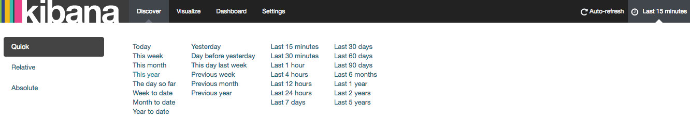
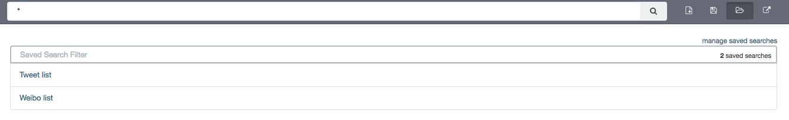
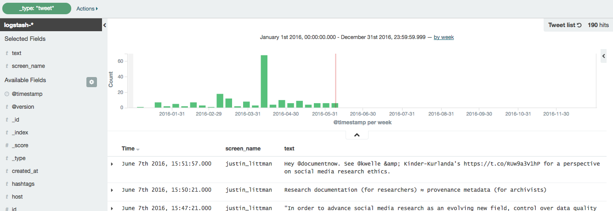
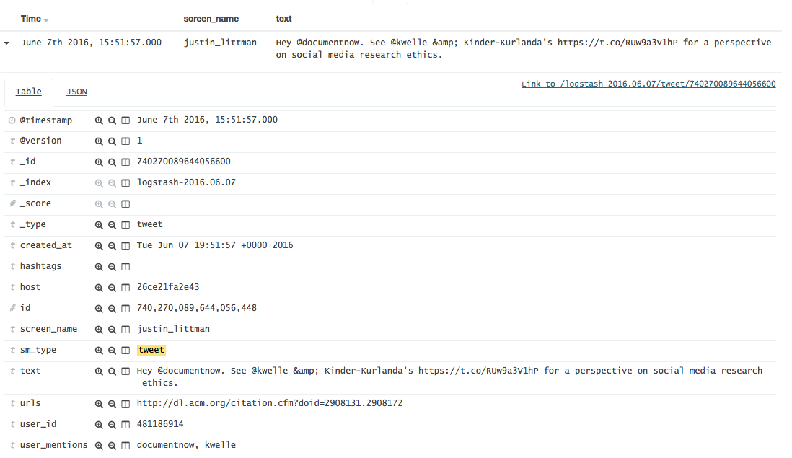
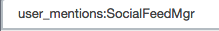
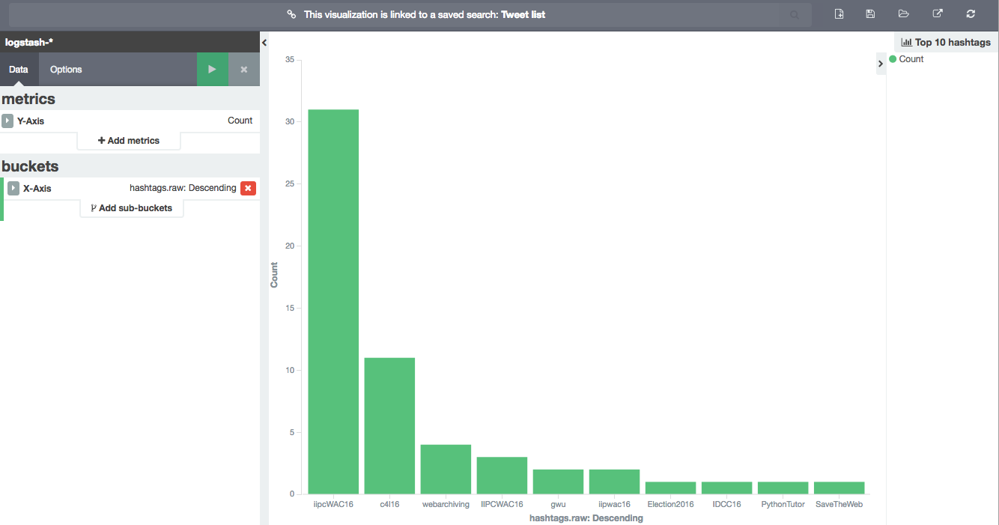
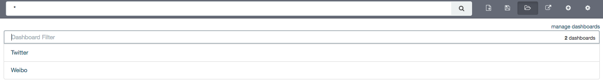
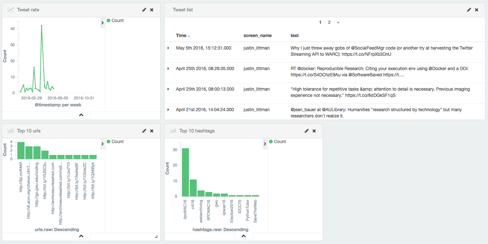

======================================
 Exploring social media data with ELK
======================================

The ELK (`Elasticsearch <https://www.elastic.co/products/elasticsearch>`_, `Logstash <https://www.elastic.co/products/logstash>`_,
`Kibana <https://www.elastic.co/products/kibana>`_) stack is a general-purpose framework for exploring data. It
provides support for loading, querying, analysis, and visualization.

SFM provides an instance of ELK that has been customized for exploring social media data. It currently supports data from
Twitter and Weibo.

One possible use for ELK is to monitor data that is being harvested to discover new seeds to select.
For example, it may reveal new hashtags or users that are relevant to a collection.

Though you can use Logstash and Elasticsearch directly, in most cases you will interact exclusively with Kibana,
which is the exploration interface.

--------------
 Enabling ELK
--------------
ELK is not available by default; it must be enabled as described here.

You can enable one or more ELK Docker containers. Each container can be configured to be loaded with all social
media data or the social media data for a single collection set.

To enable an ELK Docker container it must be added to your ``docker-compose.yml`` and then started by::

    docker-compose up -d

An example container is provided in ``example.docker-compose.yml`` and ``example.prod.docker-compose.yml``. These examples
also show how to limit to a single collection set by providing the collection set id.

By default, Kibana is available at `http://<your hostname>:5601/app/kibana <http://localhost:5601/app/kibana>`_. (Also,
by default Elasticsearch is available on port 9200 and Logstash is available on port 5000.)

If enabling multiple ELK containers, add multiple containers to your ``docker-compose.yml``. Make sure to give each container a unique name and a unique ``hostname:`` value, and make sure that each container maps to different ports.

--------------
 Loading data
--------------

ELK will automatically be loaded as new social media data is harvested. (Note, however, that there will be some latency
between the harvest and the data being available in Kibana.)

Since only new social media data is added, it is recommended that you enable the ELK Docker container before beginning
harvesting.

If you would like to load social media data that was harvested before the ELK Docker container was enabled, use the
``resendwarccreatedmsgs`` management command::

    usage: manage.py resendwarccreatedmsgs [-h] [--version] [-v {0,1,2,3}]
                                           [--settings SETTINGS]
                                           [--pythonpath PYTHONPATH] [--traceback]
                                           [--no-color]
                                           [--collection-set COLLECTION_SET]
                                           [--harvest-type HARVEST_TYPE] [--test]
                                           routing_key

The ``resendwarccreatedmsgs`` command resends warc_created messages which will trigger the loading of data by ELK.

To use this command, you will need to know the routing key. The routing key is ``elk_loader_<container id>.warc_created``.
The container id can be found with ``docker ps``.

The loading can be limited by collection set (``--collection-set``) and/or (``--harvest-type``). You can get collection
set ids from the collection set detail page. The available harvest types are twitter_search, twitter_filter,
twitter_user_timeline, twitter_sample, and weibo_timeline.

This shows loading the data limited to a collection set::

    docker exec docker_sfmuiapp_1 python sfm/manage.py resendwarccreatedmsgs --collection-set b438a62cbcf74ad0adc09be3b07f039e elk_loader_26ce21fa2e43.warc_created

--------------------
 Overview of Kibana
--------------------

The Kibana interface is extremely powerful. However, with that power comes complexity.
The following provides an overview of some basic functions in Kibana.  For some advanced
usage, see the `Kibana Reference <https://www.elastic.co/guide/en/kibana/current/index.html>`_ or the `Kibana 101: Getting Started with Visualizations <https://www.elastic.co/webinars/kibana-101-get-started-with-visualizations>`_ video.

When you start Kibana, you probably won't see any results.

This is because Kibana defaults to only showing data from the last 15 minutes. Use the
date picker in the upper right corner to select a more appropriate time range.

Tip: At any time, you can change the date range for your query, visualization, or dashboard
using the date picker.

Discover
========

The Discover tab allows you to query the social media data.

By default, all social media types are queried. By limit to a single type (e.g., tweets),
click the folder icon and select the appropriate filter.

You will now only see results for that social media type.

Notice that each social media item has a number of fields.

You can search against a field. For example, to find all tweets containing the term "archiving":

or having the hashtag #SaveTheWeb:

or mentioning @SocialFeedMgr:

Visualize
=========

The Visualize tab allows you to create visualizations of the social media data.

The types of visualizations that are supported include:

* Area chart
* Data table
* Line chart
* Pie chart
* Map
* Vertical bar chart

Describing how to create visualizations is beyond the scope of this overview.

A number of visualizations have already been created for social media data. (The available
visualizations are listed on the bottom of the page.)

For example, here is the Top 10 hashtags visualization:

Dashboard
=========

The Dashboard tab provides a summary view of data, bringing together multiple visualizations
and searches on a single page.

A number of dashboards have already been created for social media data. To select a dashboard,
click the folder icon and select the appropriate dashboard.

For example, here is the top of the Twitter dashboard:

---------
 Caveats
---------
* This is experimental. We have not yet determined the level of development that will be performed in
  the future.
* Approaches for administering and scaling ELK have not been considered.
* No security or access restrictions have been put in place around ELK.
