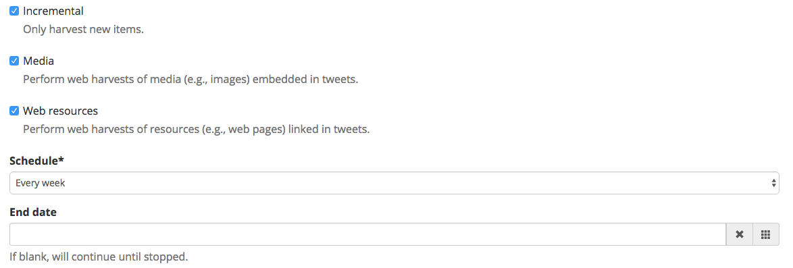
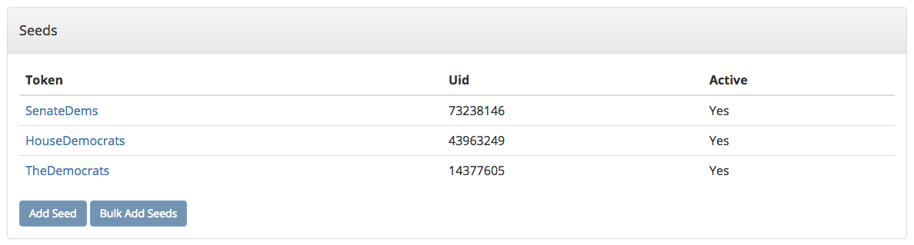
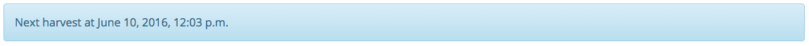
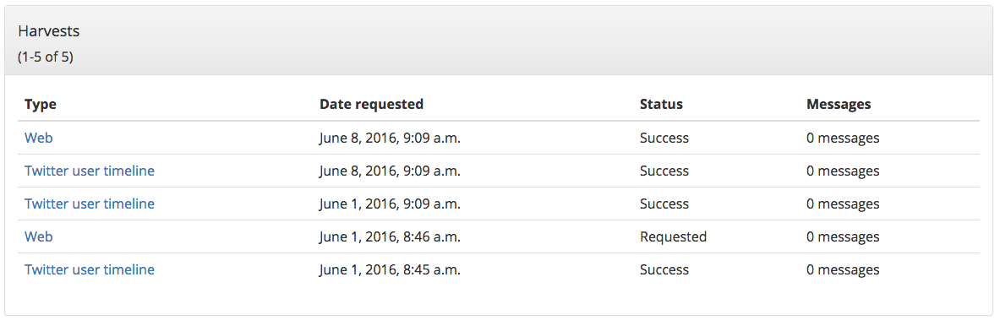
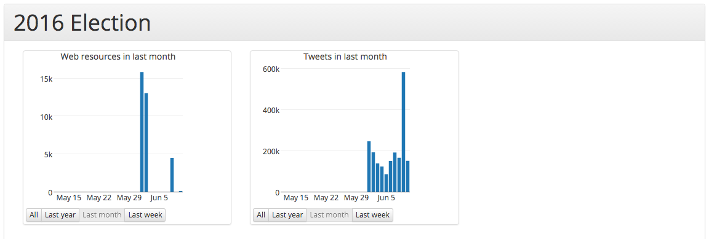
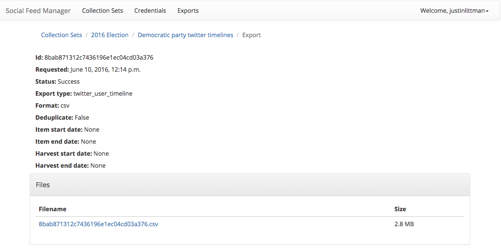
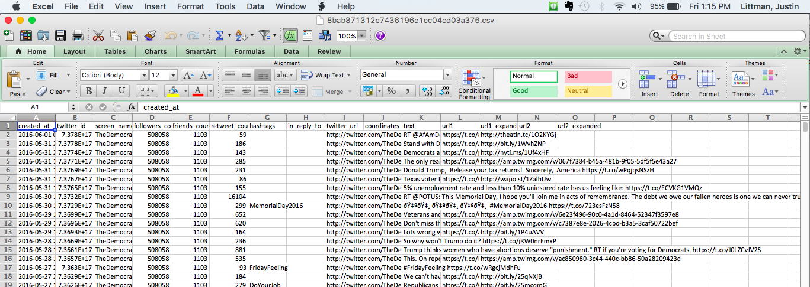
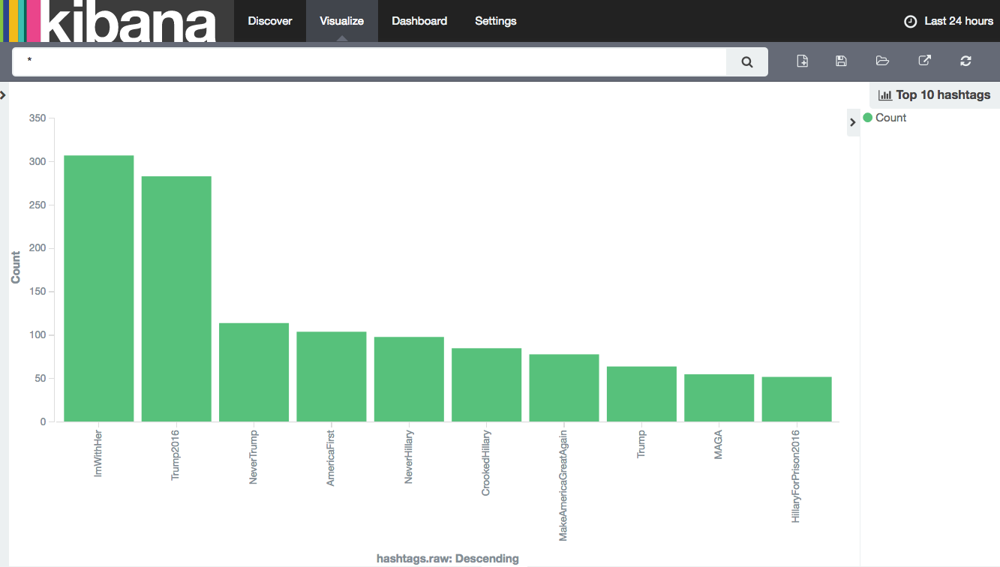

===================
Quick Start Guide
===================

This quick start guide describes how you can start using Social Feed Manager to select, harvest,
explore, export, process and analyze social media data.  This covers just the basics of using the software;
technical information about installing and administering SFM can be found in the :ref:`admin-documentation`.

------------------------------
Prerequisites
------------------------------

SFM in operation
^^^^^^^^^^^^^^^^
This quick start guide assumes SFM is already set up and running. For details about installing and administering 
SFM, see :ref:`admin-documentation`.

An SFM account
^^^^^^^^^^^^^^
You can sign up for an account by clicking the *Sign Up* link from within SFM.

If you'd like to set up shared collecting at your institution, you'll need to have your
systems administrator set up groups in SFM. When a group owns a collection, all of the
group's members can view and update the collection.

API credentials
^^^^^^^^^^^^^^^
You will need API credentials for each of the social media platforms from which you want to
collect. This is more than the Twitter/Flickr/Weibo account that you may already
have.  To get API credentials:

* Request credentials from the social media platform and enter them into Credentials section. The :doc:`credentials`
  page provides instructions for each platform.
* For some social media platforms, your administrator may have enabled an option that will allow you to
  connect your account without leaving SFM. With your permission, SFM will get credentials on your behalf.
  Click *Credentials* and then *Connect [Twitter, Tumblr, or Weibo] Account*.
* If you are part of a group, you'll be able to use the credentials already provided by another member of the group.

----------------------
Setting up collections
----------------------

Hopefully you've considered what you want to use SFM to collect: which social media accounts, which
queries/hashtags/searches/etc., and on which platform(s).  You may also have learned a bit about the social
media platforms' APIs and best practices for collecting from social media APIs.  Now you'd like to set
up your collections in SFM.

Create a collection set
^^^^^^^^^^^^^^^^^^^^^^^

At the top of the page, go to *Collection Sets* and click the *Add Collection Set* button.  A collection set is just a group
of collections around a particular topic or theme.  For example, you might set up a
"2016 U.S. Elections" collection set.

.. image:: images/quickstart/collection_set.png

Create a collection
^^^^^^^^^^^^^^^^^^^

On the collection set detail page, under *Collections* click the *Add Collection* button and select a type.

.. image:: images/quickstart/collection_types.png

Collection types differ based on the social media platform and the part of the API from which the social media is to
be collected. For more information, see :doc:`collections`.

The collection types supported by SFM include:

 * :ref:`Twitter search`
 * :ref:`Twitter filter`
 * :ref:`Twitter user timeline`
 * :ref:`Twitter sample`
 * :ref:`Flickr user`
 * :ref:`Weibo timeline`
 * :ref:`Tumblr blog posts`

SFM allows you to create multiple collections of each type within a collection set.  For example, you might
create a "Democratic candidate Twitter user timelines" collection and a "Republican candidate Twitter user
timelines" collection. Collections are one way of organizing harvested content.

Each collection's harvest type has specific options, which may include:

 * Schedule of how often to collect (e.g. daily, monthly).  Streaming harvest types such as Twitter filter don't have a schedule -- they're either on or off.
 * Whether to perform web harvests of images, videos, or web pages embedded or linked from the posts.
 * Whether to harvest incrementally.  For example, each time a Twitter user timeline harvest runs, it can either collect only new items since the last harvest, or it can try to re-collect each entire timeline.

Add seeds
^^^^^^^^^

Some harvest types require seeds, which are the specific targets for collection.

As shown in the chart below, what a seed is and the number of seeds varies by harvest type.  Note that some
harvest types don't have any seeds.

=======================   ==========================   ============
Harvest type              Seed                         How many?   
=======================   ==========================   ============
Twitter search            Search query                 1 or more
Twitter filter            Track/Follow/Locations       1 or more
Twitter user timeline     Twitter Account Name or ID   1 or more
Twitter sample            None                         None
Flickr user               Flickr Account Name or ID    1 or more
Weibo timeline            None                         None
=======================   ==========================   ============

----------------
Start harvesting
----------------
  
Each collection's detail page has a *Turn On* button.

Once you turn on the collection, harvesting will proceed in the background according to the
collection's schedule.  It will stop when it hits the end date or you turn it off.
  
The collection's detail page will also show a message noting when the next harvest is
scheduled for.

As harvesting progresses, SFM will list the results of harvests on the
collection's detail page.

-----------------
During harvesting
-----------------

Within SFM, harvesting is performed by (you guessed it) harvesters.  Harvesters
make calls to the social media platforms' APIs and records the social media data
in WARC files. (`WARC <https://en.wikipedia.org/wiki/Web_ARChive>`_ is a standard
file format used for web archiving.)

Depending on the collection options you selected, SFM may also extract URLs from
the posts; these URLs link to web resources such as images, web pages, etc.  SFM
passes the URLs to the web harvester, which will collect these web
resources (similar to more traditional web archiving).

To monitor harvesting:

 * View details on each harvest in the Harvests section of the collection detail page.
 * Check the visualizations of the number of items harvested for each collection on the home page.
   (Click *Social Feed Manager* in the top left of the page).

If you want to make changes to the collection's options and/or its seeds after
harvesting is started, turn off the collection and then click the *Edit* button.

You'll be able to turn it back on and resume collecting afterwards.

---------------------------------------------------------------------
Exploring, exporting, processing and analyzing your social media data
---------------------------------------------------------------------

SFM provides several mechanisms for exporting collected social media data or
feeding the social media data into your own processing pipelines. It also provides
some basic tools for exploring and analyzing the collected content within the
SFM environment.

Exports
^^^^^^^

To export collected social media data, click the *Export* button on the
collection detail page.  Exports are available in a number of formats, including Excel,
CSV, and JSON.

The "Full JSON" format provides the posts (e.g. tweets) in their
original form, whereas the other export formats provide a subset of the metadata
for each social media item. For example, for a tweet, the CSV export 
includes the tweet's "coordinates" value but not the "geo" value.

Refer to the :doc:`data_dictionary` for details about each of the columns in the
the CSV and Excel exports for Twitter collections.

Dehydration (exporting a list of just the IDs of social media items) is supported for certain
data-sharing purposes.  

Exports are run in the background, and larger exports may take a significant
amount of time. You will receive an email when it is completed or you can
monitor the status on the Exports page, where you can vew details about the
export.  This is also where you will find a link to download the export file
once it becomes available.  A README file will be created for each export containing
documentation on the export and the collection.

Processing
^^^^^^^^^^

If you've set up a processing container, or if you've installed SFM tools locally,
then you have access to the collected social media data from the command line.
You can then feed the data into your own processing pipeline and use your own tools.

More on this topic can be found in the :doc:`processing` section.

Exploration and analysis
^^^^^^^^^^^^^^^^^^^^^^^^

While SFM does not provide a comprehensive toolset for exploring and analyzing the
collected social media data, it provides some basic exploration and analysis tools and allows
you to export social media data for use with your own tools.

Tools provided by SFM are:

* ELK (Elasticsearch, Logstash, Kibana)

The ELK stack is a general-purpose framework for exploring data. It
provides support for loading, querying, analysis, and visualization. SFM provides an instance of ELK
that has been customized for exploring social media data, in particular, Twitter and Weibo data.

ELK may be particularly useful for monitoring and adjusting the targets of ongoing
social media collections.  For example, it can be used to discover additional
relevant Twitter hashtags or user accounts to collect, based on what has been
collected so far.

ELK requires some additional setup. More on this topic can be found in the :doc:`exploring` section.

* Processing container

A processing container allows you to have access to the collected social
media content from the command line.  The processing container has been
provisioned with a handful of analysis tools such as `Twarc utils <https://github.com/edsu/twarc/tree/master/utils>`_.

The following shows piping some tweets into a wordcloud generator from within a processing container::

    # find_warcs.py 4f4d1 | xargs twitter_rest_warc_iter.py | python /opt/twarc/utils/wordcloud.py

More on this topic can be found in the :doc:`processing` section.

------------------
Access and display
------------------

SFM does not currently provide a web interface to the collected social media
content.  However, this should be possible, and we welcome your ideas and
contributions.
