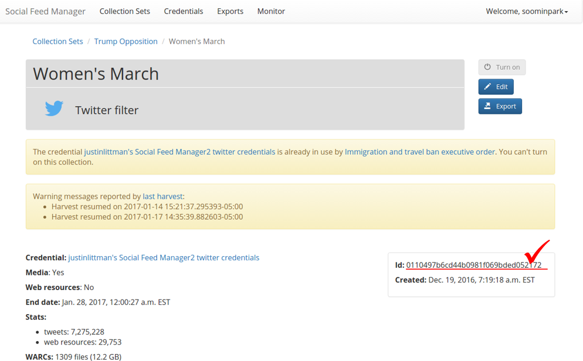

===========================
 Releasing public datasets
===========================

Many social media platforms place limitations on sharing of data collected from their APIs. One common approach
for sharing data, in particular for Twitter, is to only share the identifiers of the social media items. Someone
can then recreate the dataset be retrieving the items from the API based on the identifiers. For Twitter, the
process of extracting tweet ids is often called "dehydrating" and retrieving the full tweet is called "hydrating."

Note that retrieving the entire original dataset may not be possible, as the social media platform may opt to
not provide social media items that have been deleted or are no longer public.

This example shows the steps for releasing the `Women's March dataset <https://dataverse.harvard.edu/dataset.xhtml?persistentId=doi:10.7910/DVN/5ZVMOR>`_
to `Dataverse <http://dataverse.org/>`_. The Women's March dataset
was created by GWU and published on the `Harvard Dataverse <https://dataverse.harvard.edu/dataverse/harvard>`_.
These instructions can be adapted for publishing your own collections to the dataset repository of your choice.

Note that the Women's March dataset is a single (SFM) collection. For an example of publishing multiple collections
to a single dataset, see the `2016 United States Presidential Election dataset <https://dataverse.harvard.edu/dataset.xhtml?persistentId=doi:10.7910/DVN/PDI7IN>`_.

---------------------------
 Exporting collection data
---------------------------

1. Access the server where your target collection is located and instantiate a processing container. (See :doc:`processing`)::

        ssh gwsfm-prod2.wrlc.org
        cd /opt/sfm
        docker-compose run --rm processing /bin/bash

2. Find a list of WARC files where the data of your target collection are stored, and create a list of WARC files
(`source.lst`) and a list of destination text files (`dest.lst`)::

        find_warcs.py 0110497 | tr ' ' '\n' > source.lst
        cat source.lst | xargs basename -a | sed 's/.warc.gz/.txt/' > dest.lst

Replace 0110497 with the first few characters of the collection id that you want to export. The collection id is
available on the collection detail page in SFM UI. (See the picture below.)

3. Write the tweet ids to the destination text files::

        time parallel –j 3 -a source.lst -a dest.lst --xapply "twitter_stream_warc_iter.py {1} | jq –r ‘.id_str’  > {2}"

This commands executes a Twitter Stream WARC iterator to extract the tweets from the WARC files and jq to extract the
tweet ids. Parallel is used to perform this process in parallel (using multiple processors), using WARC files from
`source.lst` and text files from `dest.lst`.

    Note: `-j 3` limits parallel to 3 processors. Make sure to select an appropriate number for your server.
