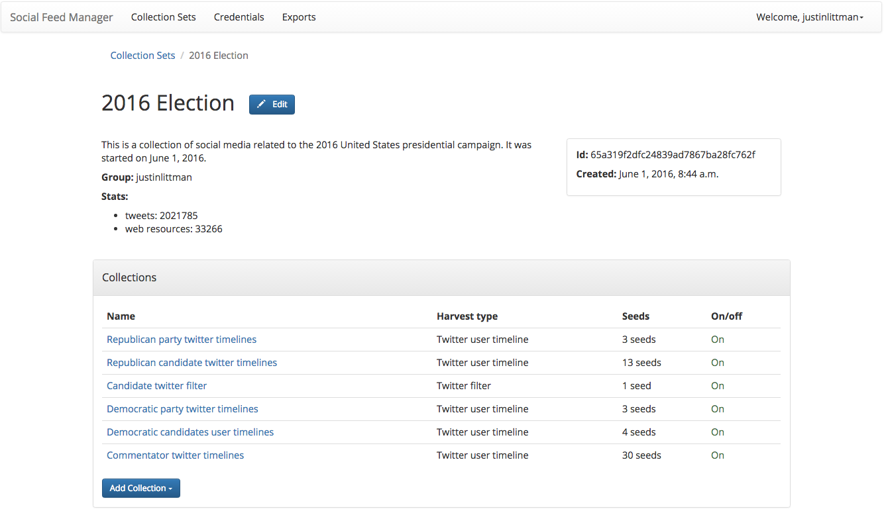

==========
User Guide
==========

Welcome to Social Feed Manager!

Social Feed Manager (SFM) is an open-source tool designed for researchers,
archivists, and curious individuals to collect social media data from Twitter,
Tumblr, Flickr, or Sina Weibo. See the `SFM Overview <https://gwu-libraries.github.io/sfm-ui/about/overview>`_
for a quick look at SFM.

If you want to learn more about what SFM can do, read :ref:`guide-uses`
This guide is for users who have access to SFM and want to learn how to collect. If
you're an administrator setting up SFM for your institution, see
:ref:`admin-documentation`.

To get your first collection up and running:
  * **Sign up**: On the SFM homepage, click "Sign up." Fill out the form,
    including a unique email. Once you sign up, you will be automatically logged in.
  * **Get credentials**: You'll need to authorize access to the social
    media platforms using credentials. See :ref:`guide-setting-up-credentials`.
  * **Create a collection set** and within it a collection, where you'll actually
    collect data. See :ref:`guide-creating-collections`.
  * **Add seeds**: Seeds are the criteria used to collect data. You'll add user
    accounts or search criteria. See :ref:`guide-adding-seeds`.
  * **Set your collections running!**
  * **Export your collections** when you want to see and work with your data, or
    adjust settings. See :ref:`guide-export-data`.

You can always come back to this user guide for help by clicking *Documentation*
at the bottom of any SFM page and selecting *User Guide*.

| `What is SFM used for?`_
|     `Types of Collections`_
|     `How to use the data`_
|     `Privacy and platform policy considerations`_
|         `Ethical considerations`_
| `Setting up Credentials`_
| `Creating Collections`_
|     `Setting up Collections and Collection Sets`_
|     `Adding Seeds`_
| `Exporting your Data`_
|
|

.. _`guide-uses`:

---------------------
What is SFM used for?
---------------------

Social Feed Manager (SFM) collects individual posts--tweets,
photos, blogs--from social media sites. These posts are collected in their native, raw data
format called JSON and can be exported in many formats, including spreadsheets.
Users can then use this collected data for research, analysis or archiving.

Some ideas for how to use SFM:
  - **Collecting from individual accounts** such as the tweets of every U.S.
    Senator (:ref:`guide-twitter-user-timelines`).
  - **Gathering Flickr images for analysis** or archiving the photographs from
    accounts donated to your organization (:ref:`guide-flickr-user-timeline`).
  - **Researching social media use** by retrieving a sample of all tweets
    (:ref:`guide-twitter-sample`), or by filtering by specific search terms
    (:ref:`guide-twitter-filter`).
  - **Capturing a major event** by collecting tweets in a specific geographic
    location or by following specific hashtags.
  - **Collecting Tumblr posts** for preserving institutional blogs or the work
    of online artists.
    (:ref:`guide-tumblr-blog-posts`).
  - **Archiving posts** from any social media platform for later research.

Note that SFM currently collects social media data from Twitter, Tumblr, Flickr,
and Sina Weibo.

Here's a sample of what a collection set looks like:

Types of Collections
^^^^^^^^^^^^^^^^^^^^

  * :ref:`guide-twitter-user-timelines`: Collect tweets from specific
    Twitter accounts
  * :ref:`guide-twitter-search`: Collects tweets by a user-provided search query
    from recent tweets
  * :ref:`guide-twitter-sample`: Collects a Twitter-provided stream of a subset
    of all tweets in real time.
  * :ref:`guide-twitter-filter`: Collects tweets by user-provided criteria from
    a stream of tweets in real time.
  * :ref:`guide-flickr-user-timeline`: Collects posts and photos from specific
    Flickr accounts
  * :ref:`guide-weibo-timelines`: Collects posts from the user and the user's
    friends
  * :ref:`guide-tumblr-blog-posts`: Collects blog posts from specific Tumblr
    blogs

How to use the data
^^^^^^^^^^^^^^^^^^^

Once you've collected data, there are a few ways to use it:
  * You could export it into a CSV or Excel format for a basic analysis
    (:ref:`guide-export-data`), or load the format into analysis software such
    as Stata, SPSS, or Gephi.
  * You could set up an archive using the JSON files or Excel files.

Privacy and platform policy considerations
^^^^^^^^^^^^^^^^^^^^^^^^^^^^^^^^^^^^^^^^^^

Collecting and using data from social media platforms is subject to those
platforms' terms (`Twitter <https://twitter.com/rules>`_,
`Flickr <https://www.flickr.com/help/guidelines>`_,
`Sina Weibo <http://www.weibo.com/signup/v5/protocol>`_,
`Tumblr <https://www.tumblr.com/policy/en/terms-of-service>`_),
as you agreed to them when you created your social media account. Social Feed
Manager respects those platforms' terms as an application
(`Twitter <https://developer.twitter.com/en/developer-terms/policy>`_,
`Flickr <https://www.flickr.com/services/developer>`_,
`Sina Weibo <http://open.weibo.com/wiki/%E9%A6%96%E9%A1%B5>`_,
`Tumblr <https://www.tumblr.com/docs/en/api_agreement>`_).

Social Feed Manager provides data to you for your research and academic use.
Social media platforms' terms of service generally do not allow republishing of
full datasets, and you should refer to their terms to understand what you may
share. Authors typically retain rights and ownership to their content.

Ethical considerations
----------------------

In addition to respecting the platforms' terms, as a user of Social Feed Manager
and data collected within it, it is your responsibility to consider the ethical
aspects of collecting and using social media data. Your discipline or
professional organization may offer guidance. In addition, take a look at
these `social media research ethical and privacy guidelines <https://gwu-libraries.github.io/sfm-ui/resources/social_media_research_ethical_and_privacy_guidelines.pdf>`_.

.. _guide-setting-up-credentials:

----------------------
Setting up Credentials
----------------------

Before you can start collecting, you need **credentials** for the social media
platform that you want to use. Credentials are keys used by each platform to
control the data they release to you.

You are responsible for creating your own credentials so that you can control
your own collection rate and make sure that you are following the policies of
each platform.

For more information about platform-specific policies, consult the documentation
for each social media platform's API.

| :ref:`twitter-credentials`
| :ref:`flickr-credentials`
| :ref:`tumblr-credentials`
| :ref:`weibo-credentials`
|
|

.. _guide-creating-collections:

--------------------
Creating Collections
--------------------

**Collections** are the basic SFM containers for social media data.
Each collection either gathers posts from individual accounts or gathers posts based
on search criteria.

Collections are contained in **collection sets**. While collection sets
sometimes only include one collection, sets can be used to organize all of the
data from a single project or archive--for example, a collection set about a
band might include a collection of the Twitter user timelines of each band
member, a collection of the band's Flickr, and a Twitter Filter collection of
tweets that use the band's hashtag.

Before you begin collecting, you may want to consider these `collection
development guidelines
<https://gwu-libraries.github.io/sfm-ui/resources/guidelines>`_.

Setting up Collections and Collection Sets
^^^^^^^^^^^^^^^^^^^^^^^^^^^^^^^^^^^^^^^^^^

Because collections are housed in collection sets, you must make a collection
set first.

Navigate to the Collection Sets page from the top menu, then click the *Add
Collection Set* button.

Give the collection set a unique name and description. A collection set is like
a folder for all collections in a project.

If you are part of a group project, you can contact your SFM administrator and
set up a new group which you can share each collection set with. (This can be
changed or added later on).

Once you are in a collection set, click the "Add Collection" dropdown menu and
select the collection type you want to add.

Enter a unique collection name and a short description. The description is a
great location to describe how you chose what to put in your collection.

Select which credential you want to use. If you need to set up new credentials,
see :ref:`guide-setting-up-credentials`.

.. _guide-adding-seeds:

Adding Seeds
^^^^^^^^^^^^

**Seeds** are the criteria used by SFM to collect social media posts. Seeds may
be individual social media accounts or search terms used to filter posts.

The basic process for adding seeds is the same for every collection type, except
for Twitter Sample and Sina Weibo:

  * Turn off the collection.
  * Click *Add Seed* for adding one seed or *Add Bulk Seeds* for multiple.
  * Enter either the user ids or search criteria and save.
  * When you have added all seeds you want, click *Turn on*.

For details on each collection type, see:

| :ref:`guide-twitter-user-timelines`
| :ref:`guide-twitter-search`
| :ref:`guide-twitter-sample`
| :ref:`guide-twitter-filter`
| :ref:`guide-flickr-user-timeline`
| :ref:`guide-weibo-timelines`
| :ref:`guide-tumblr-blog-posts`
|
|

.. _guide-export-data:

-------------------
Exporting your Data
-------------------

In order to access the data in a collection, you will need to export it. You are able 
to download your data in several formats,
including Excel (.xlsx) and Comma Separated Values (.csv), which can be
loaded into a spreadsheet or data analytic software.

To export:
  * At the top of the individual collection, click *Export*.

  * Select the file type you want (.csv is recommended; .xlsx types will also be
    easily accessible).

  * Select the export file size you want, based on number of posts per file. You may want to select
    a number of posts that will work the program that you will be loading the data into, e.g., Excel.

  * Select Deduplicate if you only want one instance of every post. This will clean
    up your data, but will make the export take longer.

  * Item start date/end date allow you to limit the export based on the date
    each post was created. Note that the date you enter will be in the local timezone. The date
    in posts may be in a different timezone, e.g., UTC. Appropriate adjustments will be made to account
    for this.

  * Harvest start date/end date allow you to limit the export based on the
    harvest dates.

  * When you have the settings you want, click *Export*. You will be
    redirected to the export screen. When the export is complete, the files,
    along with a README file describing what was included in the export and the
    collection, will appear for you to click on and download. You will receive
    an email when your export completes.

  * To help understand each metadata field in the export, see
    :ref:`data-dictionaries`.
